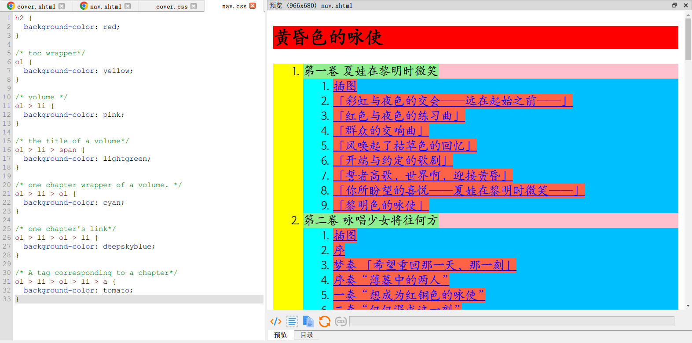

# add css to epub

这个库目前使用的是ebooklib 0.17.1 版本来对epub进行生成。 但是，在实践过程中，发现了许多的不足。


## CSS美化概要方向
对于生成的epub，美化可以从下面的几个方面入手：
- 封面：主要体现在美化封面图片样式(img)，或者自定义一个美观的封面xhtml。
- 版本信息/民间汉化信息：主要体现在文本样式(p)、上下分割线样式。
- 目录：列表样式(ol,ul,li)，以及链接样式(a)。
- 正文：p段落样式，段落首字(dropcap)下沉，段落两个字符单位(2em)缩进。
- 后记：段落p样式。


## 技术可行性检验

下面将列举使用ebooklib进行**技术可行性检验**时遇到的添加CSS的挑战：

- [x] 为cover.xhtml添加CSS link
- [x] 为nav.xhtml添加CSS link
- [x] 为常规chapter.xhtml添加CSS link

审查ebooklib中源码，分析python类的继承设计。可以看到EpubCoverHtml和EpubNav的确是继承自EpubHtml的。


而EpubHtml具有下面的方法，可以添加CSS和JS的外部声明。

```python
    def add_item(self, item):
        """
        Add other item to this document. It will create additional links according to the item type.

        :Args:
          - item: item we want to add defined as instance of EpubItem
        """
        if item.get_type() == ebooklib.ITEM_STYLE:
            self.add_link(href=item.get_name(), rel='stylesheet', type='text/css')

        if item.get_type() == ebooklib.ITEM_SCRIPT:
            self.add_link(src=item.get_name(), type='text/javascript')
```

但是，在代码中，必须留意【添加NAV的CSS样式】这个步骤与【book初始化添加NCX与NAV】的先后关系：

必须先添加NCX与NAV，然后才能添加NAV的CSS样式。

```py
# add navigation files
book.add_item(epub.EpubNcx())
book.add_item(epub.EpubNav())

# add nav css
nav_style = '''
...
'''
nav_css = epub.EpubItem(uid="style_nav", file_name="style/nav.css", media_type="text/css", content=nav_style)
nav_html = book.get_item_with_id('nav')
nav_html.add_item(nav_css)
book.add_item(nav_css)
```

## 实施
到了这里，我们已经得到了技术可行性层面的保证。接下来，需要对哔哩轻小说生成的epub的xhtml文档格式进行归纳，抽象出可以用于
CSS美化的元素。然后就可以逐步进行相应CSS规则的编写了。

更加具体地：
- 这个库应当提供基础美化的样式，当开发者不提供时，使用默认样式。
- 当开发者提供CSS样式时，应该使用提供的样式覆盖默认的样式。

> 注意：即使epub本身封装了良好的CSS美化样式，但是根据不同epub阅读器的渲染规则，得到了结果往往千差万别。
> 后续，将会对epub阅读器的选择进行讨论。

## EpubBook 文档结构

### cover.xhtml
```xhtml
<?xml version='1.0' encoding='utf-8'?>
<!DOCTYPE html>
<html xmlns="http://www.w3.org/1999/xhtml" xmlns:epub="http://www.idpf.org/2007/ops" 
      epub:prefix="z3998: http://www.daisy.org/z3998/2012/vocab/structure/#" lang="zh" xml:lang="zh">
  <head>
    <title>Cover</title>
  </head>
  <body>
 </body>
</html>
```
只有一个img标签作为封面。CSS选择器：`img[alt=Cover]`.

### nav.xhtml
```xhtml
<?xml version="1.0" encoding="utf-8"?>
<!DOCTYPE html>

<html xmlns="http://www.w3.org/1999/xhtml" xmlns:epub="http://www.idpf.org/2007/ops" lang="zh" xml:lang="zh">
<head>
  <title>黄昏色的咏使</title>
</head>

<body>
  <nav epub:type="toc" id="id" role="doc-toc">
      
  <h2>黄昏色的咏使</h2>

  <ol>
    <li>
        <span>第一卷 夏娃在黎明时微笑</span> 

         <ol>
              <li><a href="0.xhtml">插图</a></li>
        
              <li><a href="1.xhtml">「彩虹与夜色的交会──远在起始之前──」</a></li>
        
              <li><a href="2.xhtml">「红色与夜色的练习曲」</a></li>
        
              <li><a href="3.xhtml">「群众的交响曲」</a></li>
        
              <li><a href="4.xhtml">「风唤起了枯草色的回忆」</a></li>
        
              <li><a href="5.xhtml">「开端与约定的歌剧」</a></li>
        
              <li><a href="6.xhtml">「誓者高歌，世界啊，迎接黄昏」</a></li>
        
              <li><a href="7.xhtml">「你所盼望的喜悦──夏娃在黎明时微笑──」</a></li>
        
              <li><a href="8.xhtml">「黎明色的咏使」</a></li>
         </ol>
    </li>

    <li>
        <span>第二卷 咏唱少女将往何方</span> 

        <ol>
              <li><a href="9.xhtml">插图</a></li>
        
              <li><a href="10.xhtml">序</a></li>
        
              <li><a href="11.xhtml">梦奏 「希望重回那一天、那一刻」</a></li>
        
              <li><a href="12.xhtml">序奏 “薄暮中的两人”</a></li>
        
              <li><a href="13.xhtml">一奏 “想成为红铜色的咏使”</a></li>
        
              <li><a href="14.xhtml">二奏 “仅仅渴求这一刻”</a></li>
        
              <li><a href="15.xhtml">三奏 “我想逃开，可是，不知为何却又无法割舍”</a></li>
        
              <li><a href="16.xhtml">间奏 “夏季凉风的牵引”</a></li>
        
              <li><a href="17.xhtml">四奏 “请指引我，让长枪成为守护的方向”</a></li>
        
              <li><a href="18.xhtml">终奏 “众人高歌 咏唱枪使的方向”</a></li>
        
              <li><a href="19.xhtml">间奏 第二幕 “三年前——”</a></li>
        
              <li><a href="20.xhtml">赠奏 “咏唱祓名民的荣耀”</a></li>
        
              <li><a href="21.xhtml">回奏 “三年前 Lastihyt:miquvy Wer shela-c-nixer arsa”</a></li>
        
              <li><a href="22.xhtml">后记</a></li>
         </ol>
    </li>
      
  </ol>
  </nav>
</body>
</html>
```
- `<h2>黄昏色的咏使</h2>` 是作品名称。CSS选择器：h2
- 最外层的ol就是TOC目录的容器。CSS选择器：ol
  - ol的每一个直接子元素li，都表示一卷，例如第一卷，第二卷，......。CSS选择器 ol > li
    - 对于上面的li（表示每一卷），里面有一个直接的span，表示卷名称，例如：第一卷 夏娃在黎明时微笑。CSS选择器：ol > li > span
    - span下方，是一个ol列表，表示某卷下的章节。CSS 选择器：ol > li > ol。 每一个章节都是这种形式：
      ```html
      <li><a href="1.xhtml">「彩虹与夜色的交会──远在起始之前──」</a></li>
      ```
      CSS选择器：ol > li > ol > li 以及 ol > li > ol > li > a

分析完毕后，就可以根据这个结构进行CSS样式的添加。   

一个示例截图：这里利用了背景颜色对每一个CSS选择器进行高亮，增大对比度，方便调试。完成样式编写后，再隐藏调试样式。

 


### 具体章节 - 插图

```xhtml
<?xml version="1.0" encoding="utf-8"?>
<!DOCTYPE html>

<html xmlns="http://www.w3.org/1999/xhtml" xmlns:epub="http://www.idpf.org/2007/ops" 
      epub:prefix="z3998: http://www.daisy.org/z3998/2012/vocab/structure/#" lang="zh" xml:lang="zh">
<head>
  <title>插图</title>
</head>

<body>
  <h1>第一卷 夏娃在黎明时微笑</h1>

  <h2>插图</h2>

  <p></p>

  <div class="divimage">
    
  </div>

  <div class="divimage">
    
  </div>

  <div class="divimage">
    
  </div>
  
  ...(这里省略重复元素divimage)

  <style>p{text-indent:2em; padding:0px; margin:0px;}</style>
</body>
</html>
```
- `<h1>第一卷 夏娃在黎明时微笑</h1>` 这个h1只会在一卷的第一个章节中出现。选择器：h1
- `<h2>插图</h2>` 具体章节的标题. h2
- `<p></p>` 这里标签都是样式标签，也可能为`<br/>`之类。可以忽略
-  插图元素：
  ```html
    <div class="divimage">
      
    </div>
  ```
  由一个div包含，里面是一个img元素。CSS选择器：`.divimage` 和 `.divimage > img`


### 具体章节 - 常规正文
```xhtml
<?xml version="1.0" encoding="utf-8"?>
<!DOCTYPE html>

<html xmlns="http://www.w3.org/1999/xhtml" xmlns:epub="http://www.idpf.org/2007/ops" epub:prefix="z3998: http://www.daisy.org/z3998/2012/vocab/structure/#" lang="zh" xml:lang="zh">
<head>
  <title>「群众的交响曲」</title>
</head>

<body>
  <h2>「群众的交响曲」</h2>

  <p>1</p>

  <p>校舍的窗外可以看到小鸟成群飞过。距离班会开始还剩下半小时左右，
      是其他学生还在进行社团活动晨间练习的时刻。此时进入教室里的学生人数并不多。</p>

  <p>「喔，库露露你怎么啦？今天来得真早。」</p>

  <p>蜜欧是少数的例外之一。她似乎比班上的其他同学早到，而且每天早上还偷偷地用功自习。虽然她本人想要隐瞒这件事，不过可惜的是，
      这早已成为班上众所皆知的事实。</p>
  
  ...
</body>
</html>
```
正文章节中，主要含有三种元素：
- `<h2>「群众的交响曲」</h2>` 章节标题. h2
- `<p>(这里是文字段落)</p>` . p
- 可能出现的插图元素将会是这种形式：
  ```html
  <p> </p>
  ```
  可以通过 `p > img` 进行选择.

### 自定义字体
> 自定义字体的职责优先考虑于制作端，而不是阅读端。

```python
with open('Fonts/LXGWWenKai-Regular.ttf', 'rb') as f:
    font_content = f.read()

# https://idpf.github.io/epub-cmt/v3/
font_item = epub.EpubItem(uid='LXGWWenKai-Regular', file_name='Fonts/LXGWWenKai-Regular.ttf',
                          media_type='application/font-sfnt', content=font_content)
book.add_item(font_item)
```
这里只是以文件方式引入了字体，要将字体应用到书籍显示中，还需要在CSS规则中定义和使用。

可以在全局CSS文件中定义字体，然后在body中启用字体：
```css
@font-face {
   font-family: "LXGWWenKai-Regular";
   font-weight: normal;
   font-style: normal;
   src: url(./Fonts/LXGWWenKai-Regular.ttf);
}

body {
  font-family: "LXGWWenKai-Regular",sans-serif;
}
```